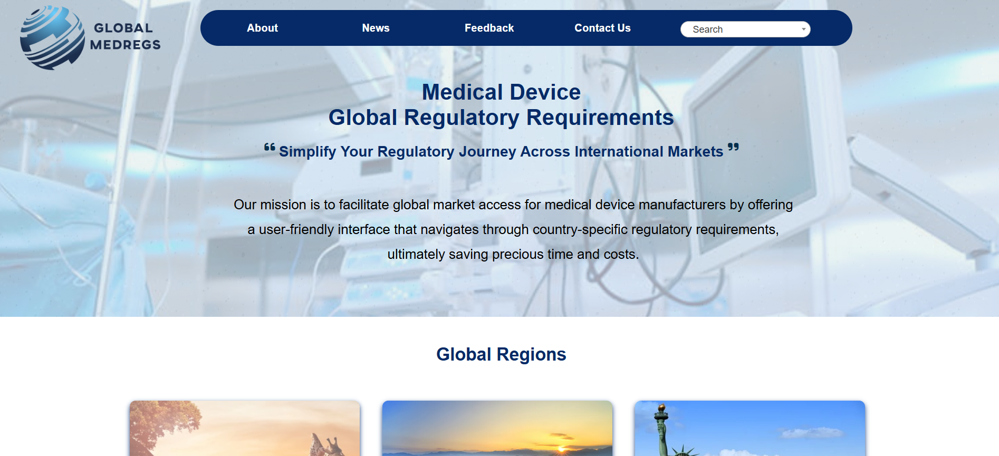

# Global Medreg
Facilitates global market access for medical device manufacturers with a user-friendly interface that simplifies country-specific regulatory requirements, saving time and costs.

## 🚀 Tech Stack
- HTML
- CSS
- JavaScript
- Firebase
- canva

## ✨ Features
- Responsive design
- User-friendly layout
- Interactive elements (add 1–2 project-specific highlights)

## 📂 Project Context
Built as part of client projects at K-AKA Technology Services, focusing on delivering practical and visually appealing websites.

## 📸 Screenshots
  

## 🔎 Note
This site is not live anymore, but the repository remains as part of my portfolio.
This was developed during my time at a startup for real clients.  
Although the site is not deployed live anymore, this repository showcases the code, design, and development work I contributed.
